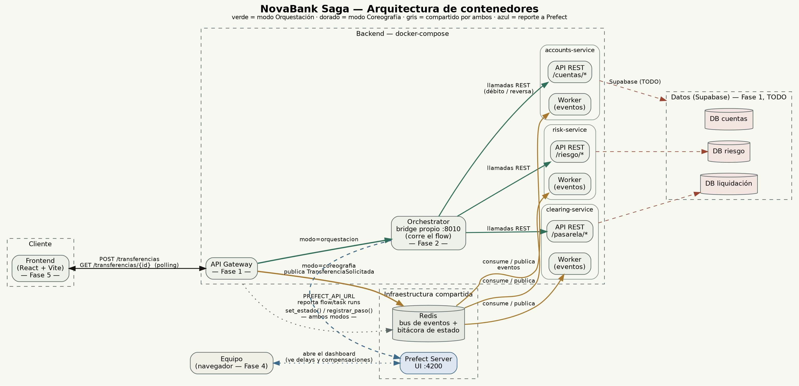

# Arquitectura de contenedores — NovaBank Saga

Pedido explícitamente en el enunciado ("diagramas de flujo completos" y
"C4 — contenedores/componentes", Criterio 6) y en el checklist (Fase 7, f7-2).



Fuente editable en `arquitectura-c4.dot` (Graphviz):

```bash
dot -Tpng -Gdpi=170 docs/arquitectura-c4.dot -o docs/arquitectura-c4.png
dot -Tsvg docs/arquitectura-c4.dot -o docs/arquitectura-c4.svg
```

## Cómo leerlo

- **Verde = modo Orquestación.** El Gateway le pasa la transferencia al
  Orchestrator (flow de Prefect), y es él quien llama uno por uno a los
  tres microservicios por REST — el único que conoce el guion completo.
- **Dorado = modo Coreografía.** El Gateway solo publica el evento
  inicial (`TransferenciaSolicitada`) en Redis. De ahí en adelante nadie
  manda: cada worker de eventos escucha lo que le interesa, actúa, y
  publica el siguiente evento — el Orchestrator ni se entera de que esto
  está pasando.
- **Gris punteado = compartido por ambos modos.** Tanto el Orchestrator
  como las APIs REST de los tres servicios escriben en la misma bitácora
  de Redis (`set_estado()` / `registrar_paso()`), y el Gateway la lee
  para el `GET /transferencias/{id}` que consume el frontend. Por eso el
  timeline se ve igual sin importar qué modo eligió el usuario.
- **Rojo punteado = todavía no implementado.** *(Desactualizado: la
  conexión a Supabase que marcaba en rojo ya está implementada en los 3
  microservicios desde la sesión de Fase 1 — falta regenerar
  `arquitectura-c4.dot`/`.png`/`.svg` para sacar esa marca; el texto de acá
  ya no aplica.)*

## Qué NO muestra este diagrama (a propósito)

Es un diagrama de **contenedores** (nivel 2 de C4): qué corre, en qué
proceso, y cómo se conectan. No entra en las clases o funciones internas
de cada servicio — eso sería el nivel 3 (componentes), opcional si les
sobra tiempo en la Fase 7.
