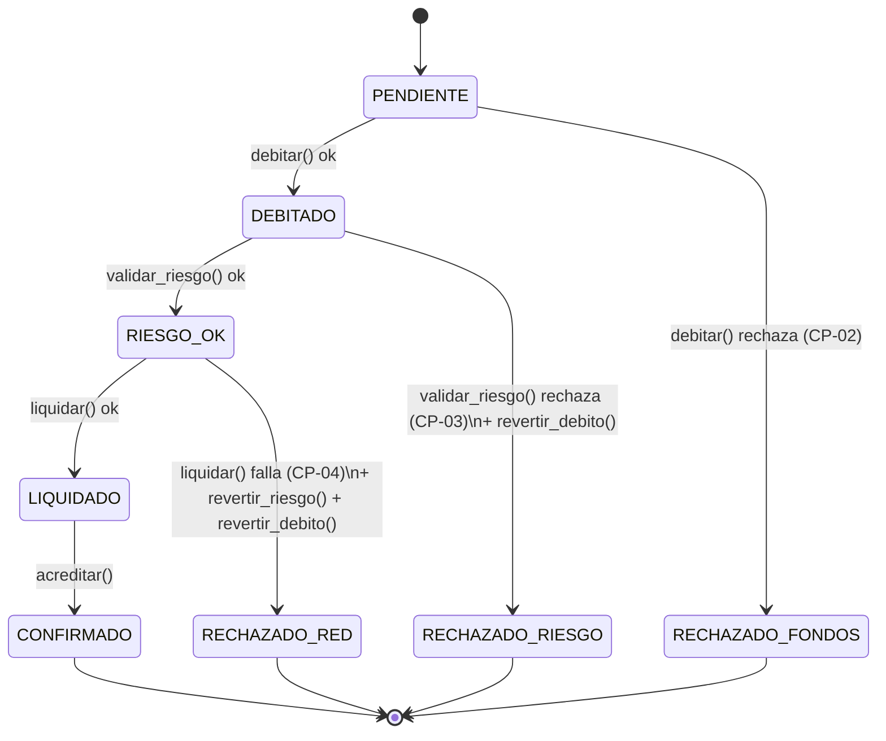

# Diagrama de la máquina de estados — Saga de Transferencia

Pedido explícitamente en la rúbrica ("diagramas de flujo completos", Criterio 6).
Versión Mermaid del diagrama de CONTEXT.md — pégenlo en el README o en el
documento final; GitHub lo renderiza solo.

Falta: diagrama de secuencia por modo (uno para Orquestación, uno para
Coreografía) mostrando quién llama a quién — o quién publica/escucha qué
evento. Fase 7, junto con el C4.
